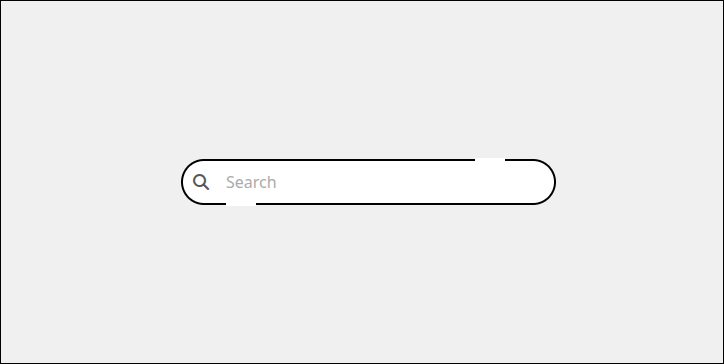

# Animated Search Bar

This project demonstrates a modern, animated search bar built with **HTML**, **CSS**, and **JavaScript**.  
The animation includes swipe effects, dynamic placeholder behavior, and smooth transitions.

🔗 **Live Demo**: [View on GitHub Pages](https://deepak200440022.github.io/search_bar/)

## Features

- Fluid animated swipe on focus
- Dynamic placeholder handling
- Color and state transitions for active/hovered/submitted states
- Responsive and minimal design

## Technologies Used

- HTML5
- CSS3 (Pure CSS for animations and styling)
- JavaScript (Vanilla)
- FontAwesome (for search icon)

## Screenshot



## Usage

1. Clone this repository:
   ```bash
   git clone https://github.com/deepak200440022/search_bar.git
   ```
2. Open `index.html` in any modern browser.

## License

This project is open-source and available under the [MIT License](LICENSE).
